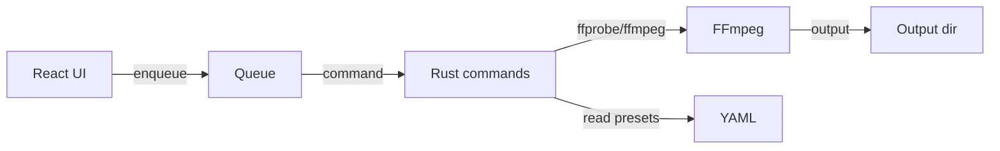

# Media Compressor — overview

Components:

- React/Vite UI: drag-and-drop, presets, size estimator.
- Tauri commands: probe media, transcode with selected preset, manage HW accel flags.
- Presets: YAML with codec/container/bitrate/CRF targets.
